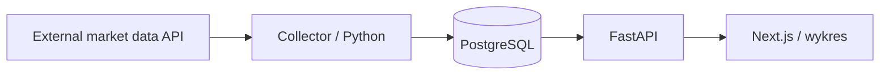
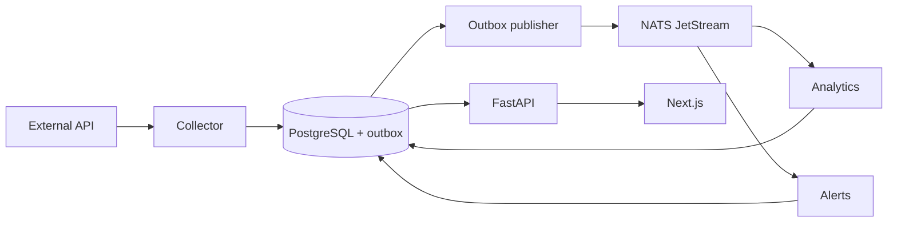

# Architektura MarketPulse

Status: projekt architektury, jeszcze bez implementacji. Dokument zachowuje
ustalony kierunek; szczegóły proponowane poniżej należy weryfikować podczas prac.

## Cel i zakres

Platforma pobiera dane rynkowe i przechowuje własną historię na potrzeby wykresów,
porównań, watchlist, analiz oraz alertów cenowych. Początkowy zakres to
AAPL, MSFT i NVDA. ETF-y, forex i crypto mogą dojść po ustabilizowaniu modelu danych.
Nie budujemy systemu realizującego transakcje ani infrastruktury high-frequency trading.

Projekt służy nauce kontenerów, Kubernetes, komunikacji asynchronicznej,
obserwowalności, GitOps oraz odtwarzania po awarii. Docelowo działa na jednym
Raspberry Pi 5 z SSD 1 TB, Linux ARM64 i K3s. Restart poda nie zapewnia dostępności
podczas awarii jedynego hosta lub dysku.

## Minimalny przepływ v1

Collector pobiera jeden ustalony interwał, waliduje dane i zapisuje świece OHLCV.
API udostępnia historię, frontend wyświetla wykres. V1 nie potrzebuje brokera.
Kandydatem na dostawcę jest Twelve Data; limity, dostępność instrumentów i prawa
do publikowania danych trzeba sprawdzić przed integracją. Warstwa adaptera pozwoli
zmienić dostawcę bez przebudowania API i analityki.

## Docelowe komponenty

| Komponent | Odpowiedzialność | Planowany model uruchomienia |
| --- | --- | --- |
| Frontend | Dashboard, wykresy, watchlisty, konfiguracja alertów | Next.js Deployment |
| API | Odczyt danych, watchlisty, reguły alertów, później WebSocket | FastAPI Deployment |
| Collector | Integracja z dostawcą, normalizacja, import historii | CronJob; później proces dla streamingu |
| Analytics | Returns, moving averages, volatility, correlations, drawdown | Python worker Deployment |
| Alerts | Ocena reguł, historia wywołań, deduplikacja | Python worker Deployment |
| PostgreSQL | Trwałe dane domenowe | Usługa stanowa z PVC na SSD |
| NATS | Dystrybucja zdarzeń; JetStream dla trwałości | Usługa z trwałym storage dla JetStream |

Market API, Watchlist API i Alert API są początkowo modułami jednego FastAPI.
Nie wymagają trzech osobnych wdrożeń. Workery nie potrzebują FastAPI, jeśli nie
udostępniają HTTP; sposób health checks dobierz do procesu.

## Zdarzenia i spójność — propozycja dla v3+

Zapis notowania i rekordu outbox w jednej transakcji ma zapobiegać utracie zdarzenia
między zapisem do bazy a publikacją. Publisher może początkowo należeć do collectora;
nie wymaga osobnego serwisu domenowego. Po potwierdzeniu publikacji oznacza rekord
jako wysłany. Awaria pomiędzy tymi krokami nadal może spowodować duplikat.

Proponowany temat to `market.candles.updated.v1`. Zdarzenie zawiera `event_id`,
`schema_version`, `occurred_at`, identyfikator instrumentu, dostawcę, interwał,
czas świecy i kontekst trace. Konsumenci analytics i alerts mają niezależne
subskrypcje trwałe; kopie tego samego workera współdzielą pracę w ramach własnej grupy.

Przyjmujemy at-least-once delivery: ACK następuje po trwałym zapisie wyniku,
a deduplikacja chroni przed powtórzeniem efektów. Retry musi mieć limit i obsługę
trwale błędnych komunikatów. Szczegóły streamów, retencji i obsługi błędów zostaną
zdefiniowane wraz z implementacją. Kanał powiadomień zewnętrznych nie jest wybrany.

## Dane — proponowany model początkowy

- `instruments`: symbol, giełda/rynek, klasa aktywów, waluta, symbol u dostawcy.
- `candles`: instrument, provider, interwał, timestamp UTC, OHLCV. Unikalność
  `(provider, instrument_id, interval, timestamp)` umożliwia idempotentny upsert.
- `watchlists` i `watchlist_items`: listy oraz przypisane instrumenty.
- `analytics_results`: wyniki z okresem i wersją algorytmu.
- `alert_rules` i `alert_events`: reguły progowe oraz historia ich uruchomień.
- `outbox_events` i ewidencja przetworzenia: dodawane przy wdrażaniu messagingu.

Jeden PostgreSQL ogranicza koszty operacyjne. Serwisy dostają odrębne role i jasno
określone prawa do tabel; nie każdy serwis zapisuje wszystko. Collector odpowiada
za notowania, analytics za wyniki, API za watchlisty/reguły, alerts za ich wywołania.
Schemat i migracje trzeba wybrać przed pierwszą implementacją.

Ceny przechowujemy jako wartości dziesiętne z jawną walutą. UTC nie zastępuje
kalendarza sesji giełdowych. Dla zwrotów i porównań należy określić sposób obsługi
braków, splitów, dywidend i danych adjusted/unadjusted przed liczeniem wskaźników.

## K3s, Helm i GitOps

- Początkowo jeden węzeł i po jednej replice aplikacji, skalowanie po pomiarach.
- `infra/k8s`: bootstrap i zasoby klastra poza chartami aplikacji.
- `infra/helm`: charty aplikacji oraz konfiguracja zależności i środowisk.
- `infra/argocd`: deklaracje aplikacji śledzących konfigurację w Git.
- Obrazy muszą wspierać `linux/arm64`; wersje i digesty ustalamy w implementacji.
- Docelowy pipeline: testy → build → skan obrazu → GHCR → aktualizacja referencji
  obrazu w Git → synchronizacja Argo CD. Sam push obrazu nie zmienia deploymentu.
- Ingress przez Traefik jest planowany; domena, TLS i ewentualny Cloudflare Tunnel
  pozostają do decyzji. PostgreSQL i NATS nie są publicznie dostępne.
- PostgreSQL i JetStream wymagają PVC. Backup musi trafić poza ten sam SSD;
  harmonogram, retencja, RPO/RTO i test restore zostaną określone przed stałym użyciem.
- Requests/limits, probes, NetworkPolicy i ograniczenia retencji dobieramy do
  zasobów hosta. Przy CronJob trzeba zapobiegać nakładającym się importom.

## Obserwowalność

| Narzędzie | Rola |
| --- | --- |
| Prometheus | Metryki infrastruktury i aplikacji |
| Grafana | Dashboardy, wizualizacja metryk i logów |
| Loki | Centralne logi strukturalne |
| OpenTelemetry | Instrumentacja i propagacja kontekstu przez HTTP i zdarzenia |

OpenTelemetry nie jest magazynem trace'ów. Backend śladów i konfigurację Collectora
wybierzemy w etapie obserwowalności; nie dodajemy ich teraz jako ustalonej zależności.
Podstawowe logi i health checks wdrażamy od v1. Docelowe sygnały obejmują opóźnienie
notowań, błędy i limity dostawcy, opóźnienie konsumentów, retry, czas odpowiedzi API,
wywołania alertów, zajętość dysku i wiek backupu. Logi nie zawierają sekretów.

## Otwarte decyzje i kryteria pierwszego etapu

Do ustalenia: dostawca i interwał danych, wersje runtimów, narzędzia migracji
i zależności, logowanie użytkowników, kanały powiadomień, domena, sposób zarządzania
sekretami (np. SOPS albo Sealed Secrets), trace backend oraz polityka backupu.
Przed publicznym udostępnieniem należy wdrożyć odpowiednią kontrolę dostępu.

V1 jest gotowe, gdy import trzech instrumentów można bezpiecznie powtórzyć,
API zwraca zapisane dane, frontend rysuje wykres i pokazuje stan braku danych/błędu,
a dane pozostają po restarcie aplikacji. Testy obejmują normalizację, upsert,
błędy dostawcy oraz odczyt API. Osobny test wdrożeniowy potwierdzi działanie na ARM64.
Kolejne etapy opisuje [roadmapa](../README.md#roadmapa).
