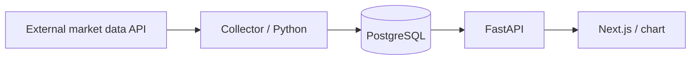
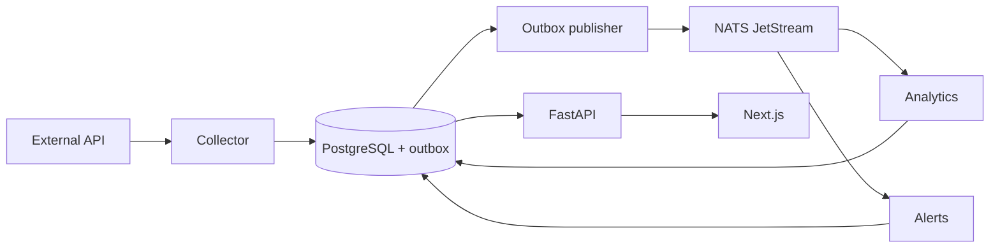

# MarketPulse architecture

Status: architecture proposal, not yet implemented. This document preserves the
agreed direction; the proposed details below should be verified during implementation.

## Purpose and scope

The platform collects market data and stores its own history for charts,
comparisons, watchlists, analytics, and price alerts. The initial scope covers
AAPL, MSFT, and NVDA. ETFs, forex, and crypto may follow once the data model is stable.
Trade execution and high-frequency trading infrastructure are outside the scope.

The project teaches containers, Kubernetes, asynchronous messaging, observability,
GitOps, and disaster recovery. The target is a single Raspberry Pi 5 with a 1 TB
SSD, Linux ARM64, and K3s. Restarting a pod does not provide availability when the
only host or disk fails.

## Minimal v1 data flow

The collector fetches data at one agreed interval, validates it, and stores OHLCV
candles. The API serves historical data, and the frontend displays a chart. V1 does
not require a broker. Twelve Data is a candidate provider; limits, instrument
availability, and redistribution rights must be checked before integration.
A provider adapter will allow switching providers without redesigning the API or analytics.

## Target components

| Component | Responsibility | Planned runtime |
| --- | --- | --- |
| Frontend | Dashboard, charts, watchlists, alert configuration | Next.js Deployment |
| API | Data access, watchlists, alert rules, later WebSocket | FastAPI Deployment |
| Collector | Provider integration, normalization, historical imports | CronJob; later a streaming process |
| Analytics | Returns, moving averages, volatility, correlations, drawdown | Python worker Deployment |
| Alerts | Rule evaluation, trigger history, deduplication | Python worker Deployment |
| PostgreSQL | Durable domain data | Stateful service with an SSD-backed PVC |
| NATS | Event distribution; JetStream for durability | Service with persistent storage for JetStream |

Market API, Watchlist API, and Alert API initially live as modules within one
FastAPI application. They do not require three separate deployments. Workers do
not need FastAPI unless they expose HTTP; choose health checks appropriate to each process.

## Events and consistency — proposal for v3+

Writing a price record and an outbox entry in one transaction is intended to prevent
event loss between database writes and publication. The publisher can initially
belong to the collector; it does not require a separate domain service. After
publication is acknowledged, it marks the entry as sent. A failure between these
steps can still produce duplicates.

The proposed subject is `market.candles.updated.v1`. Each event includes `event_id`,
`schema_version`, `occurred_at`, the instrument identifier, provider, interval,
candle timestamp, and trace context. Analytics and alerts use independent durable
subscriptions; replicas of the same worker share work within their own group.

Assume at-least-once delivery: acknowledge messages after results are durably
stored, and use deduplication to prevent repeated effects. Retries must be bounded,
with handling for permanently invalid messages. Stream configuration, retention,
and failure handling will be defined during implementation. An external
notification channel has not been selected.

## Data — proposed initial model

- `instruments`: symbol, exchange/market, asset class, currency, provider symbol.
- `candles`: instrument, provider, interval, UTC timestamp, OHLCV. A unique key on
  `(provider, instrument_id, interval, timestamp)` enables idempotent upserts.
- `watchlists` and `watchlist_items`: lists and their associated instruments.
- `analytics_results`: results with the calculation period and algorithm version.
- `alert_rules` and `alert_events`: threshold rules and their trigger history.
- `outbox_events` and processing records: introduced with messaging.

A single PostgreSQL instance reduces operational overhead. Services receive separate
roles and explicit table permissions; not every service writes to every table.
The collector owns prices, analytics owns calculated results, the API owns watchlists
and rules, and alerts owns trigger records. Schema and migration tooling must be
chosen before the first implementation.

Store prices as decimal values with explicit currencies. UTC does not replace
exchange trading calendars. Before calculating returns and comparisons, define
how to handle missing data, splits, dividends, and adjusted versus unadjusted prices.

## K3s, Helm, and GitOps

- Start with one node and one replica per application; scale based on measurements.
- `infra/k8s`: bootstrap and cluster resources outside application charts.
- `infra/helm`: application charts, dependency configuration, and environment settings.
- `infra/argocd`: application declarations tracking configuration in Git.
- Images must support `linux/arm64`; choose versions and digests during implementation.
- Target pipeline: tests → build → image scan → GHCR → update image references
  in Git → Argo CD synchronization. Pushing an image alone does not update a deployment.
- Traefik ingress is planned; the domain, TLS, and a possible Cloudflare Tunnel
  remain open decisions. PostgreSQL and NATS are not publicly exposed.
- PostgreSQL and JetStream require PVCs. Backups must be stored outside the same SSD;
  define scheduling, retention, RPO/RTO, and restore tests before ongoing use.
- Size requests/limits, probes, NetworkPolicy, and retention settings for the host.
  Prevent overlapping imports when using a CronJob.

## Observability

| Tool | Role |
| --- | --- |
| Prometheus | Infrastructure and application metrics |
| Grafana | Dashboards, metric and log visualization |
| Loki | Centralized structured logs |
| OpenTelemetry | Instrumentation and context propagation through HTTP and events |

OpenTelemetry is not a trace store. Select a trace backend and Collector configuration
during the observability stage; these are not fixed dependencies yet. Basic logging
and health checks start in v1. Target signals include data freshness, provider errors
and rate limits, consumer lag, retries, API response times, alert triggers, disk usage,
and backup age. Logs must not contain secrets.

## Open decisions and first-stage acceptance criteria

Still to be decided: data provider and interval, runtime versions, migration and
dependency tooling, user authentication, notification channels, domain, secret
management (such as SOPS or Sealed Secrets), trace backend, and backup policy.
Implement appropriate access controls before exposing the application publicly.

V1 is complete when imports for the three instruments can be safely repeated,
the API returns stored data, the frontend renders a chart and handles empty/error
states, and data survives application restarts. Tests cover normalization, upserts,
provider failures, and API reads. A separate deployment test will verify ARM64 operation.
See the [roadmap](../README.md#roadmap) for subsequent stages.
